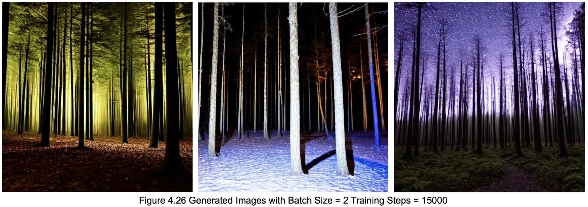
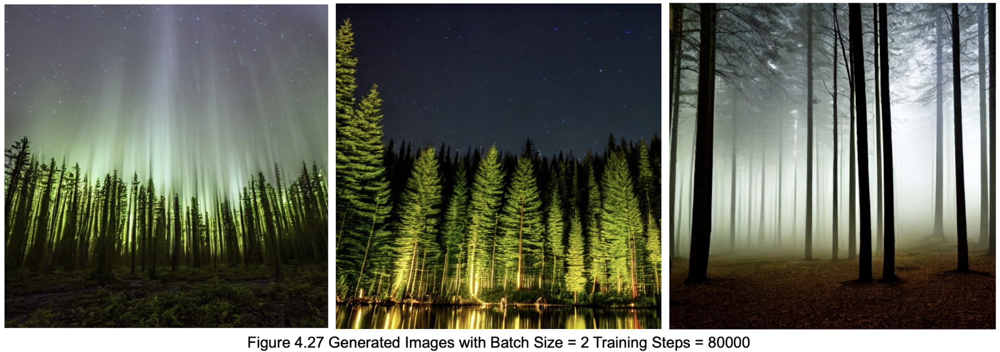
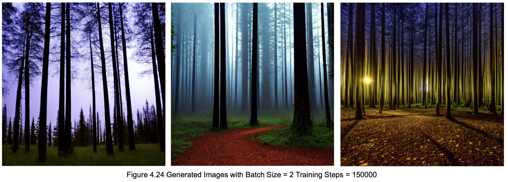

# noisy-image-generation

This research demonstrates an attempt to utilize diffusion models in producing noisy image data in an expectancy to use produced images 
for data, required to train image generation models and overall to see the capabilities of the model in generating noisy data overall.

# From-Pre-Trained


 
The model being used is [HuggingFace Diffusion Models](https://huggingface.co/docs/diffusers/v0.13.0/en/index).
Specifically [Stable Diffusion v1-5](https://huggingface.co/docs/diffusers/v0.13.0/en/api/pipelines/stable_diffusion/overview)

The used device is an Apple Silicon (M2 Pro) Mac.
To view all dependencies (see `requirements.txt`);
```

pip3 install accelerate
pip3 install diffusers
pip3 install transformers

```
Scripts used for evaluations can be found under `scripts/` subdirectory, under the name of the specific model used.
Different prompts used to test different cases can be found commented under corresponding titles.
The script have written to use random seed values to ensure reproduction is possible.
Some of the generated images for different cases can be found under `text2img/` and `img2img/` subdirectories. The image files
include the used seed number at the end of the file name.

# Fine-Tuning

By utilizing LoRA (Low-Rank Adaptation) text-to-image model acquired from [HuggingFace Diffusion Models](https://huggingface.co/docs/diffusers/v0.13.0/en/index) 
the model was tested in regards to it's capability to adapt noisy images.

All testing was conducted under the official HuggingFace Diffusers Library and can be re-run by copying
the files of this repo to the directory `examples/text-to-image` located in the official project repository.

# How To Run It ?

On a Virtual Environment

Start by cloning the HuggingFace Diffusers Library and install initial dependencies
```
git clone https://github.com/huggingface/diffusers.git

pip install diffusers
pip install accelerate
pip install transformers
pip install torch
```

Then Navigate to the following directory:
```
cd diffusers
cd examples
cd text_to_image
```

You can copy the python scripts given on this repository which includes a tweaked version of the training scripts for it to work with dataset having no captions.
The files should be pasted on `diffusers/examples/text_to_image` folder.

Install additional dependencies for Fine-Tuning
```
pip install -r requirements.txt
```

Acquire an Access Token from [HuggingFace](https://huggingface.co/settings/tokens)

After initial login you can head over to settings then Access Tokens tab and create a new token for yourself

To use the token run the following command and paste your token when prompted.
```
huggingface-cli login
```
To start fine-tuning you can run the sample script given down below which will start fine-tuning with LoRA by default.

DATASET_NAME should be indicating a dataset acquired from [HuggingFace Datasets](https://huggingface.co/datasets) and the name should be concise with the author and dataset name as shown below.
```
export MODEL_NAME="CompVis/stable-diffusion-v1-4"
export DATASET_NAME="ishicode/low-light-dataset"
```
```
accelerate launch train_text_to_image_lora_tweaked.py \
  --pretrained_model_name_or_path=$MODEL_NAME \
  --dataset_name=$DATASET_NAME \
  --caption_column="label" \
  --resolution=512 \
  --random_flip \
  --train_batch_size=2 \
  --num_train_epochs=100 \
  --checkpointing_steps=5000 \
  --learning_rate=1e-04 \
  --lr_scheduler=constant \
  --lr_warmup_steps=0 \
  --max_train_steps=15000 \
  --seed=42 \
  --output_dir=low_light_model_lora \
  --validation_prompt="low light forest"
```

# After Fine-Tuning

Once the training is finished the model will be saved in the `output_dir` specified in the command. 
In the above example it's `low_light_model_lora`. 
To load the fine-tuned model for inference just pass that path to `StableDiffusionPipeline`

```
from diffusers import StableDiffusionPipeline
import torch
import random

model_path = "path_to_your_model" # Your model path in your local directory.
pipe = StableDiffusionPipeline.from_pretrained("CompVis/stable-diffusion-v1-4")
pipe.unet.load_attn_procs(model_path)
pipe.to("cuda")


prompt = ("a forest at midnight, "
           "darkness, pitch black,"
           "shot with dslr, low exposure, low-light,"
           "night time, low brightness,"
           "loss of detail, 4k")
negative_prompt = "bad anatomy, disfigured, ugly, deformed, poor details, disfigured face"

image = pipe(prompt=prompt, negative_prompt=negative_prompt,
                 num_inference_steps=75, guidance_scale=7.5).images[0]
image.save("low-light.png")
```

# Used Scripts Training Using Mixed Dataset 

The script below was used to train the model on the mixed image dataset
and the training steps then were increased to 80000 for further testing.

```
export MODEL_NAME="CompVis/stable-diffusion-v1-4"
export DATASET_NAME="ishicode/low-light-dataset"

accelerate launch train_text_to_image_lora_tweaked.py \
  --pretrained_model_name_or_path=$MODEL_NAME \
  --dataset_name=$DATASET_NAME \
  --caption_column="label" \
  --resolution=512 \
  --random_flip \
  --train_batch_size=2 \
  --num_train_epochs=100 \
  --checkpointing_steps=5000 \
  --learning_rate=1e-04 \
  --lr_scheduler=constant \
  --lr_warmup_steps=0 \
  --max_train_steps=15000 \
  --seed=42 \
  --output_dir=low_light_only_low_model_lora \
  --validation_prompt="low light forest"

```

# Used Script for The Low-Light Only Dataset

The script below was used to train the model on the low-light only dataset
and the training steps then were increased to 80000 for further testing.

```
export MODEL_NAME="CompVis/stable-diffusion-v1-4"
export DATASET_NAME="ishicode/low-light-dataset2"

accelerate launch train_text_to_image_lora_tweaked_only_low_light.py \
  --pretrained_model_name_or_path=$MODEL_NAME \
  --dataset_name=$DATASET_NAME \
  --resolution=512 \
  --random_flip \
  --train_batch_size=2 \
  --num_train_epochs=200 \
  --checkpointing_steps=5000 \
  --learning_rate=5e-05 \
  --lr_scheduler=constant \
  --lr_warmup_steps=0 \
  --max_train_steps=15000 \
  --seed=42 \
  --output_dir=low_light_only_low_model_lora_experimental_80000 \
  --validation_prompt="low light forest"

```

# Generated Image Samples

Below are some of the sample images generated by different iterations 
of the trained model more of them can be found over at `fine_tuning/exampled/text_to_image/LoRA Images`




