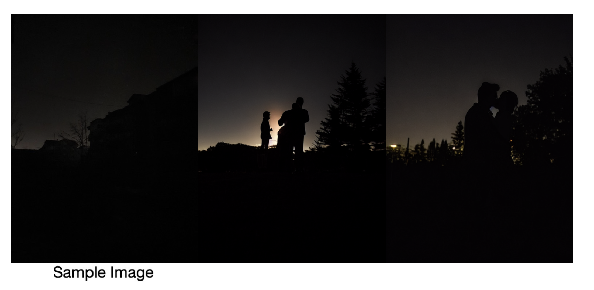
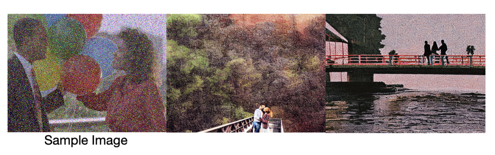

# noisy-image-generation




This repo demonstrates an attempt to utilize diffusion models in producing noisy image data in an expectancy to use produced images 
for data, required to train image generation models and overall to see the capabilities of the model in generating noisy data overall.
 
The model being used is [HuggingFace Diffusion Models](https://huggingface.co/docs/diffusers/v0.13.0/en/index).
Specifically [Stable Diffusion v1-5](https://huggingface.co/docs/diffusers/v0.13.0/en/api/pipelines/stable_diffusion/overview)

The used device is an Apple Silicon (M2 Pro) Mac.
To view all dependencies (see `requirements.txt`);
```

pip3 install accelerate
pip3 install diffusers
pip3 install transformers

```
Scripts used for evaluations can be found under `scripts/` subdirectory, under the name of the specific model used.
Different prompts used to test different cases can be found commented under corresponding titles.
The script have written to use random seed values to ensure reproduction is possible.
Some of the generated images for different cases can be found under `text2img/` and `img2img/` subdirectories. The image files
include the used seed number at the end of the file name.

